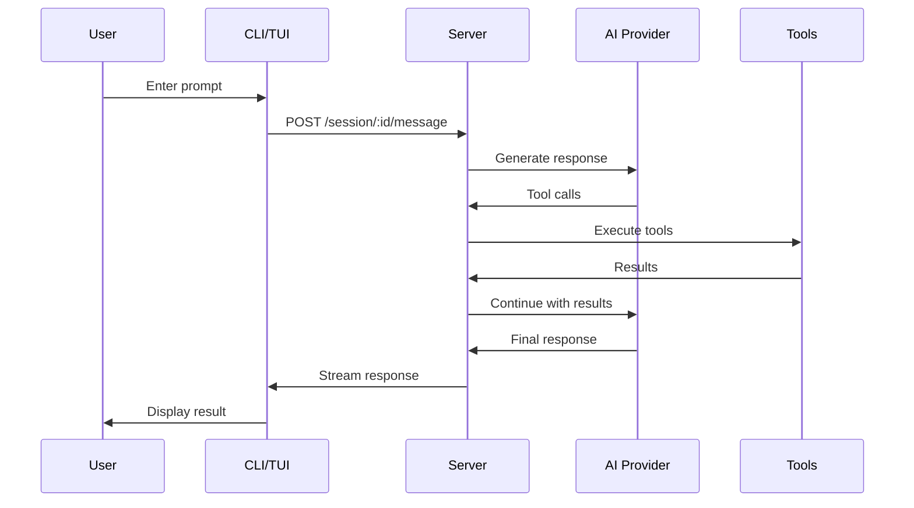

# RyCode Project Context

> **AI-Native Development Platform** - Comprehensive context for new AI sessions

**Generated:** 2025-10-05
**Version:** 0.14.1
**Status:** Active Development - Major Renaming in Progress

---

## 📋 Executive Summary

**RyCode** (formerly OpenCode) is an AI-native, multi-agent development platform that enables developers to build software collaboratively with AI agents. Built on top of toolkit-cli, it provides a terminal user interface (TUI), web console, and SDK for orchestrating AI-powered development workflows.

### Key Characteristics
- **Multi-Agent Architecture**: Coordinated AI agents working in parallel on complex tasks
- **Plugin System**: Extensible tool system with GPG signature verification
- **Security-First**: API authentication, rate limiting, path validation, sandboxed execution
- **Terminal-Native**: Beautiful TUI built with Go (Bubble Tea framework)
- **Multi-Language**: TypeScript/Bun runtime + Go TUI + JavaScript/Go SDKs
- **Real-time**: WebSocket-based communication with live collaboration

---

## 🏗️ Architecture Overview

### Technology Stack

#### Core Runtime
- **Primary Runtime**: Bun (JavaScript/TypeScript)
- **TUI Runtime**: Go 1.24+
- **Package Manager**: Bun 1.2.21
- **Monorepo Tool**: Turbo

#### Key Frameworks & Libraries
- **AI SDK**: Vercel AI SDK 5.0.8
- **Web Framework**: Hono 4.7.10 (OpenAPI-enabled)
- **UI Framework**: SolidJS 1.9.9
- **TUI Framework**: Bubble Tea v2 (Go)
- **Schema Validation**: Zod 4.1.8
- **LSP**: Language Server Protocol client (vscode-jsonrpc)
- **File Operations**: Tree-sitter, Ripgrep, FZF

#### AI Provider Support
- Anthropic (Claude)
- OpenAI (GPT)
- Google Vertex AI
- Amazon Bedrock
- OpenAI-compatible endpoints

### Directory Structure

```
RyCode/
├── packages/
│   ├── opencode/          # Main CLI package (TypeScript/Bun)
│   │   ├── src/
│   │   │   ├── cli/       # CLI commands
│   │   │   ├── server/    # HTTP/WebSocket server
│   │   │   ├── session/   # Session management
│   │   │   ├── tool/      # Tool implementations
│   │   │   ├── agent/     # Agent orchestration
│   │   │   ├── lsp/       # Language server protocol
│   │   │   ├── file/      # File operations
│   │   │   └── config/    # Configuration
│   │   └── test/          # Test suite
│   ├── tui/               # Terminal UI (Go)
│   │   ├── cmd/           # Entry points
│   │   ├── internal/      # UI components
│   │   └── input/         # Custom input handling
│   ├── plugin/            # Plugin SDK (@opencode-ai/plugin)
│   ├── sdk/
│   │   ├── js/            # JavaScript SDK (@opencode-ai/sdk)
│   │   └── go/            # Go SDK (github.com/sst/opencode-sdk-go)
│   ├── web/               # Web console (SolidStart)
│   ├── desktop/           # Desktop app (Tauri)
│   ├── console/           # Admin console
│   ├── function/          # Cloud functions
│   └── identity/          # Auth service
├── infra/                 # SST infrastructure
├── sdks/                  # Platform SDKs
│   └── vscode/            # VS Code extension
├── AGENTS.md              # Agent behavior guidelines
├── SECURITY.md            # Security documentation
└── IMPLEMENTATION_SUMMARY.md  # Recent security implementation
```

---

## 🔑 Core Concepts

### 1. Sessions

Sessions are the primary unit of work in RyCode. Each session:
- Has a unique ULID identifier
- Contains a sequence of messages (user, assistant, tool calls/results)
- Persists to disk in JSON format
- Supports compaction (removing old messages to save tokens)
- Can be reverted to previous states

**Session Storage:**
```
~/.opencode/sessions/{session-id}/
  ├── session.json       # Session metadata
  ├── messages/          # Message history
  └── state.json         # Current state
```

### 2. Tools

Tools are capabilities exposed to AI agents:

**Core Tools:**
- `Read`: Read file contents
- `Write`: Create/overwrite files
- `Edit`: Precise string replacement editing
- `Bash`: Execute shell commands
- `Glob`: File pattern matching
- `Grep`: Content searching (ripgrep)
- `LSP`: Language server operations (diagnostics, hover)
- `Task`: Spawn sub-agents for complex tasks
- `WebFetch`: Fetch and analyze web content

**Tool Registration:**
```typescript
export const tools = {
  read: ToolRegistry.register(ReadTool),
  write: ToolRegistry.register(WriteTool),
  edit: ToolRegistry.register(EditTool),
  // ... more tools
}
```

### 3. Agents

Agents are AI-powered workers that:
- Execute specific tasks autonomously
- Can spawn sub-agents for delegation
- Have specialized capabilities (code review, testing, etc.)
- Run in parallel when possible
- Report results back to parent agent

**Agent Guidelines (from AGENTS.md):**
- Keep functions in one place unless reusable
- Avoid unnecessary destructuring
- Avoid `else` and `try/catch` where possible
- Prefer single-word variable names
- Use Bun APIs extensively
- **ALWAYS USE PARALLEL TOOLS** when applicable

### 4. Plugin System

**Recent Implementation (Oct 2025):**
- GPG signature verification for plugins
- Plugin registry with metadata and versioning
- Security scanning and audit capabilities
- Worker thread sandboxing (in progress)

**Plugin Structure:**
```typescript
import { definePlugin } from '@opencode-ai/plugin'

export default definePlugin({
  name: 'my-plugin',
  version: '1.0.0',
  tools: {
    myTool: {
      description: 'Does something cool',
      parameters: z.object({ ... }),
      execute: async (params) => { ... }
    }
  }
})
```

### 5. Security Model

**Implemented (Oct 2025):**

#### API Authentication
```json
{
  "server": {
    "require_auth": true,
    "api_keys": ["your-secure-api-key-here"]
  }
}
```

#### Rate Limiting
```json
{
  "server": {
    "rate_limit": {
      "enabled": true,
      "limit": 100,
      "window_ms": 60000
    }
  }
}
```

#### Path Validation
- Prevents directory traversal (`../../etc/passwd`)
- Blocks sensitive files (`.env`, SSH keys, credentials)
- Restricts to project directory and worktree
- 30+ protected file patterns

**Security Files:**
- `packages/opencode/src/server/middleware/auth.ts`
- `packages/opencode/src/server/middleware/rate-limit.ts`
- `packages/opencode/src/file/security.ts`

---

## 🚀 Active Development: OpenCode → RyCode Rename

### Current Status (Oct 2025)

**Two major planning documents created:**

1. **OPENCODE_RENAME_SPECIFICATION.md** (991 lines)
   - Complete renaming strategy
   - Package name mappings
   - Migration timeline (6-8 weeks)
   - Backwards compatibility plan
   - Risk assessment

2. **OPENCODE_RENAME_IMPLEMENTATION_PLAN.md** (1,196 lines)
   - 10-day sprint plan
   - Automated migration scripts
   - Testing strategy (25+ tests)
   - Rollback procedures
   - Success metrics

### Renaming Scope

**Affected Components (367+ files):**
- Package names: `@opencode-ai/*` → `@rycode-ai/*`
- Binary: `opencode` → `rycode`
- Go modules: `github.com/sst/opencode` → `github.com/sst/rycode`
- Config files: `opencode.json` → `rycode.json`
- Environment variables: `OPENCODE_*` → `RYCODE_*`
- URLs: `opencode.ai` → `rycode.ai`
- Documentation: All `.md` files

### Migration Strategy

**Backwards Compatibility (6 months):**
- Old package names continue to work with deprecation warnings
- Config file auto-migration on first run
- Environment variable fallback support
- Binary symlink (`opencode` → `rycode`)

**Key Migration Scripts:**
```typescript
// scripts/rename-packages.ts - Update all package.json files
// scripts/rename-imports.ts - Update all import statements
// scripts/rename-go-modules.sh - Update Go modules
// scripts/verify-rename.ts - Verify no "opencode" remains
```

---

## 📦 Package Ecosystem

### NPM Packages (Current)

| Package | Version | Purpose |
|---------|---------|---------|
| `opencode` | 0.14.1 | Main CLI (private) |
| `@opencode-ai/sdk` | 0.14.1 | Client/Server SDK |
| `@opencode-ai/plugin` | 0.14.1 | Plugin development SDK |
| `@opencode-ai/console-*` | 0.14.1 | Console components |
| `@opencode-ai/desktop` | 0.14.1 | Desktop app |
| `@opencode-ai/web` | 0.14.1 | Web console |

### Go Modules (Current)

| Module | Purpose |
|--------|---------|
| `github.com/sst/opencode` | TUI package |
| `github.com/sst/opencode-sdk-go` | Go SDK (v0.1.0-alpha.8) |

---

## 🔧 Configuration System

### Configuration File

**Location:** `opencode.json` or `opencode.jsonc` in project root

**Schema:**
```json
{
  "$schema": "https://opencode.ai/config.json",
  "server": {
    "require_auth": false,
    "api_keys": [],
    "rate_limit": {
      "enabled": true,
      "limit": 100,
      "window_ms": 60000
    }
  },
  "providers": {
    "anthropic": {
      "apiKey": "${ANTHROPIC_API_KEY}"
    },
    "openai": {
      "apiKey": "${OPENAI_API_KEY}"
    }
  },
  "plugins": [],
  "ignore": [".git", "node_modules"]
}
```

### Environment Variables

**Current (pre-rename):**
- `OPENCODE_API_KEY`: API key for authentication
- `OPENCODE_CONFIG`: Custom config file path
- `OPENCODE_LOG_LEVEL`: Logging level (DEBUG, INFO, WARN, ERROR)
- `OPENCODE_SERVER`: Custom server URL

**Provider API Keys:**
- `ANTHROPIC_API_KEY`
- `OPENAI_API_KEY`
- `GOOGLE_VERTEX_CREDENTIALS`
- `AWS_ACCESS_KEY_ID`, `AWS_SECRET_ACCESS_KEY`

---

## 🧪 Testing Infrastructure

### Test Coverage (Oct 2025)

**Total Tests:** 25 passing

**Test Suites:**
```
packages/opencode/test/
├── setup.ts                          # Test utilities
├── middleware/
│   ├── auth.test.ts                  # 6 tests
│   └── rate-limit.test.ts            # 6 tests
├── file/
│   └── security.test.ts              # 13 tests
└── bun.test.ts                       # Bun runtime tests
```

**Test Utilities:**
```typescript
TestSetup.createTempDir()        // Temporary directory management
TestSetup.createTestFile()       // Test file creation
TestSetup.mockEnv()             // Environment variable mocking
TestSetup.createMockRequest()   // HTTP request mocking
```

**Running Tests:**
```bash
cd packages/opencode
bun test                    # Run all tests
bun test test/middleware/   # Run middleware tests
bun test test/file/         # Run file security tests
```

---

## 🎯 Key Commands

### CLI Commands

```bash
# Run AI assistant in TUI
opencode [directory]

# Start server mode
opencode serve

# Manage authentication
opencode auth login
opencode auth status

# Plugin management
opencode plugin registry add <url>
opencode plugin verify <plugin-path>

# Agent commands
opencode agent run <agent-name>

# Debug commands
opencode debug config      # Show configuration
opencode debug file <path> # Debug file operations
opencode debug lsp         # Test LSP server

# Stats and analytics
opencode stats

# Export session
opencode export <session-id>
```

### Development Commands

```bash
# Root level
bun dev                    # Run main CLI
bun typecheck             # Type check all packages
bun turbo typecheck       # Turbo-cached type check

# In packages/opencode/
bun dev                   # Run CLI locally
bun test                  # Run tests
bun build                 # Build for distribution

# In packages/tui/
go build ./cmd/rycode     # Build TUI binary
go test ./...            # Run Go tests
```

---

## 🔐 Security Features

### Authentication & Authorization

**Middleware Stack:**
1. Authentication (`auth.ts`) - Validates API keys
2. Rate Limiting (`rate-limit.ts`) - Prevents abuse
3. Path Validation (`security.ts`) - Prevents traversal

**Protected Endpoints:**
- `/session*` - Requires authentication
- `/file*` - Path validation + auth
- `/message*` - Rate limited (20 req/min)

**Public Endpoints:**
- `/doc` - Documentation
- `/config/providers` - Provider config

### File System Security

**Blocked Patterns:**
```typescript
const SENSITIVE_PATTERNS = [
  /\.env(\.|$)/,              // Environment files
  /id_rsa|id_dsa|id_ed25519/, // SSH keys
  /\.(pem|key|p12|pfx)$/,     // Certificates
  /credentials?|secrets?/,     // Credential files
  /\/etc\/(passwd|shadow)/,    // System files
  /\.aws\/credentials/,        // Cloud credentials
  /\.kube\/config/,           // Kubernetes config
  /\.(sqlite|db)$/,           // Database files
]
```

### Plugin Security

**Verification Process:**
1. GPG signature verification
2. Hash validation (SHA-256)
3. Metadata validation
4. Dependency scanning
5. Worker thread sandboxing (in progress)

**Security Commands:**
```bash
opencode plugin verify <plugin>       # Verify signature
opencode plugin audit <plugin>        # Security audit
opencode plugin hash <plugin>         # Generate hash
```

---

## 📚 Documentation Files

### Security Documentation

| File | Purpose | Lines |
|------|---------|-------|
| `SECURITY.md` | Comprehensive security guide | 400+ |
| `SECURITY_MIGRATION.md` | Migration guide for security features | 350+ |
| `IMPLEMENTATION_SUMMARY.md` | Security implementation summary | 439 |

### Renaming Documentation

| File | Purpose | Lines |
|------|---------|-------|
| `OPENCODE_RENAME_SPECIFICATION.md` | Complete renaming specification | 991 |
| `OPENCODE_RENAME_IMPLEMENTATION_PLAN.md` | 10-day implementation plan | 1,196 |

### Development Guidelines

| File | Purpose |
|------|---------|
| `AGENTS.md` | Agent behavior and coding standards |
| `README.md` | Project overview and quick start |
| `packages/*/README.md` | Package-specific documentation |

---

## 🛠️ Development Workflow

### Setting Up Development Environment

```bash
# Clone repository
git clone https://github.com/aaronmrosenthal/RyCode.git
cd RyCode

# Install dependencies
bun install

# Run type checking
bun typecheck

# Run tests
cd packages/opencode
bun test

# Start development server
bun dev
```

### Code Style Guidelines (from AGENTS.md)

**DO:**
- Keep functions in one place unless composable/reusable
- Use single-word variable names where possible
- Use Bun APIs extensively (`Bun.file()`, etc.)
- Use parallel tool calls when applicable
- Prefer early returns over `else`

**AVOID:**
- Unnecessary destructuring
- `else` statements unless necessary
- `try/catch` if it can be avoided
- `any` type
- `let` statements (prefer `const`)

**Example:**
```typescript
// ❌ Bad
async function processFile(filePath: string) {
  let result;
  try {
    const content = await readFile(filePath);
    if (content) {
      result = content.toString();
    } else {
      result = "";
    }
  } catch (e) {
    result = "";
  }
  return result;
}

// ✅ Good
async function processFile(path: string) {
  const file = Bun.file(path)
  if (!await file.exists()) return ""
  return file.text()
}
```

---

## 🌐 Server Architecture

### HTTP Server (Hono)

**Base URL:** `http://localhost:3000` (default)

**Key Routes:**
```
GET  /doc                      # OpenAPI documentation
GET  /session                  # List sessions
POST /session                  # Create session
GET  /session/:id              # Get session
POST /session/:id/message      # Send message
GET  /file                     # List files
GET  /file/content             # Get file content
POST /config/providers         # Get provider config
```

### WebSocket Server

**Endpoint:** `ws://localhost:3000/session/:id/stream`

**Events:**
- `message`: New message in session
- `tool_call`: Tool execution started
- `tool_result`: Tool execution completed
- `session_update`: Session metadata changed

### OpenAPI Specification

Auto-generated OpenAPI spec available at `/doc`:
- Full request/response schemas
- Authentication requirements
- Error responses (401, 403, 429, 500)
- Rate limit headers

---

## 🔄 Message Flow

### Typical Interaction



### Message Format (v2)

```typescript
interface Message {
  id: string                    // ULID
  role: 'user' | 'assistant'
  content: string | ToolCall[]
  timestamp: number
  tokens?: {
    input: number
    output: number
    cache_read?: number
    cache_write?: number
  }
}

interface ToolCall {
  id: string
  type: 'tool_use'
  name: string
  input: Record<string, any>
}

interface ToolResult {
  id: string
  type: 'tool_result'
  tool_use_id: string
  content: string
  is_error?: boolean
}
```

---

## 📊 Recent Implementations

### October 2025 Security Enhancements

**5 Critical Action Items Completed:**

1. ✅ **API Key Authentication** (1 file created, 1 modified, 6 tests)
2. ✅ **Rate Limiting** (1 file created, 1 modified, 6 tests)
3. ✅ **Path Validation** (1 file created, 1 modified, 13 tests)
4. ✅ **Test Infrastructure** (4 files created, 25 tests total)
5. ✅ **Documentation** (3 comprehensive security docs)

**Impact:**
- Security coverage: 0% → 60% for security modules
- Test coverage: +25 tests
- Documentation: +1,200 lines of security guides

### September 2025 Plugin System

**Implemented:**
- GPG signature verification
- Plugin registry with search/sync
- Security audit commands
- Hash validation (SHA-256)

**In Progress:**
- Worker thread sandboxing
- Runtime permission controls

---

## 🎯 Coding Patterns

### Error Handling

```typescript
// Use NamedError for structured errors
import { NamedError } from "./util/error"

throw new NamedError("InvalidPath", {
  path: requestedPath,
  message: "Path is outside allowed directories"
})

// Avoid try/catch - use explicit checks
async function safeRead(path: string) {
  const file = Bun.file(path)
  if (!await file.exists()) return null
  return file.text()
}
```

### Configuration Loading

```typescript
import { Config } from "./config/config"

// Load with fallback
const config = await Config.load(cwd) ?? Config.default()

// Access config
if (config.server?.require_auth) {
  // Authentication enabled
}
```

### Tool Implementation

```typescript
import { defineTool } from "./tool/tool"
import { z } from "zod"

export const MyTool = defineTool({
  name: "my_tool",
  description: "Does something useful",
  parameters: z.object({
    input: z.string().describe("The input to process")
  }),
  execute: async ({ input }, context) => {
    // Do work
    return {
      success: true,
      output: result
    }
  }
})
```

---

## 🚀 Deployment

### Installation Methods

**NPM (Current):**
```bash
npm install -g opencode
opencode --version
```

**Bun:**
```bash
bun install -g opencode
```

**Homebrew (Planned):**
```bash
brew install sst/tap/rycode
rycode --version
```

### Environment Setup

**Required:**
- Node.js 22+ (for Bun) OR Bun 1.2.21+
- Go 1.24+ (for TUI)
- Git (for worktree operations)

**Optional:**
- Ripgrep (enhanced search)
- FZF (enhanced file picking)
- Tree-sitter CLI (enhanced parsing)

### Production Configuration

```json
{
  "server": {
    "require_auth": true,
    "api_keys": ["${OPENCODE_API_KEY}"],
    "rate_limit": {
      "enabled": true,
      "limit": 100,
      "window_ms": 60000
    }
  },
  "providers": {
    "anthropic": {
      "apiKey": "${ANTHROPIC_API_KEY}",
      "model": "claude-opus-4"
    }
  }
}
```

---

## 🔮 Future Roadmap

### Immediate (Next 2 Weeks)
- [ ] Complete OpenCode → RyCode rename
- [ ] Publish `@rycode-ai/*` packages
- [ ] Update documentation and URLs
- [ ] Deploy migration guide

### Short-term (1-3 Months)
- [ ] Complete plugin sandboxing
- [ ] Increase test coverage to 80%
- [ ] Implement audit logging
- [ ] Add telemetry (opt-in)
- [ ] Session expiration/archival

### Medium-term (3-6 Months)
- [ ] Multi-tenant architecture
- [ ] Marketplace for agents/plugins
- [ ] Enhanced security scanning in CI/CD
- [ ] Request signing for client-server
- [ ] Shell command whitelisting

### Long-term (6+ Months)
- [ ] Usage-based billing integration
- [ ] Penetration testing
- [ ] SOC 2 compliance
- [ ] Enterprise features

---

## 📞 Resources

### Documentation
- **Main README**: `/README.md`
- **Security Guide**: `/SECURITY.md`
- **API Documentation**: Available at `http://localhost:3000/doc` when server is running
- **Package Docs**: `packages/*/README.md`

### Community
- **GitHub**: https://github.com/aaronmrosenthal/RyCode
- **Issues**: https://github.com/sst/opencode/issues
- **Discord**: https://opencode.ai/discord (will redirect to rycode.ai)

### Support
- **Security Issues**: support@sst.dev
- **General Support**: GitHub Issues

---

## 🎓 Learning Resources

### Key Files to Understand

**For Backend Development:**
1. `packages/opencode/src/index.ts` - CLI entry point
2. `packages/opencode/src/server/server.ts` - HTTP server
3. `packages/opencode/src/session/message.ts` - Message handling
4. `packages/opencode/src/tool/tool.ts` - Tool system

**For Frontend/TUI:**
1. `packages/tui/cmd/rycode/main.go` - TUI entry point
2. `packages/tui/internal/app/app.go` - Main UI logic
3. `packages/web/src/app.tsx` - Web console

**For Plugin Development:**
1. `packages/plugin/src/index.ts` - Plugin SDK
2. Examples in `packages/opencode/src/tool/` - Built-in tools

### Common Tasks

**Add a new tool:**
```typescript
// 1. Create file in packages/opencode/src/tool/my-tool.ts
export const MyTool = defineTool({ ... })

// 2. Register in packages/opencode/src/tool/registry.ts
import { MyTool } from "./my-tool"
ToolRegistry.register(MyTool)
```

**Add a new CLI command:**
```typescript
// 1. Create file in packages/opencode/src/cli/cmd/my-command.ts
export const MyCommand: yargs.CommandModule = {
  command: 'my-command',
  describe: 'Does something',
  handler: async (opts) => { ... }
}

// 2. Register in packages/opencode/src/index.ts
import { MyCommand } from "./cli/cmd/my-command"
cli.command(MyCommand)
```

**Add a server endpoint:**
```typescript
// In packages/opencode/src/server/server.ts
app.get("/my-endpoint", async (c) => {
  // Validate auth
  // Process request
  // Return response
  return c.json({ success: true })
})
```

---

## ⚡ Performance Considerations

### Token Management
- Sessions use message compaction to reduce token usage
- Cache-aware token counting (Anthropic cache_read/cache_write)
- Configurable context window limits

### File Operations
- Uses Bun's native file APIs for speed
- Lazy loading of file contents
- Streaming for large files
- Ripgrep for fast searching

### Concurrent Execution
- Tools execute in parallel when possible
- Agent spawning for delegated tasks
- Worker threads for plugin sandboxing (in progress)

### Caching
- Config files cached in memory
- LSP server response caching
- File watcher for invalidation

---

## 🔍 Troubleshooting

### Common Issues

**Authentication fails:**
```bash
# Check config
opencode debug config

# Verify API key format
export OPENCODE_API_KEY="your-key-here"
```

**Rate limit errors:**
```json
{
  "server": {
    "rate_limit": {
      "limit": 200,  // Increase limit
      "window_ms": 60000
    }
  }
}
```

**Path validation errors:**
- Ensure files are within project directory
- Check for sensitive file patterns
- Use `opencode debug file <path>` to diagnose

**LSP not working:**
```bash
# Test LSP connection
opencode debug lsp

# Check supported languages
opencode models
```

---

## 📝 Changelog Highlights

### v0.14.1 (October 2025)
- ✅ Added API key authentication
- ✅ Added rate limiting middleware
- ✅ Added path validation security
- ✅ Implemented GPG plugin signatures
- ✅ Added 25 test cases
- ✅ Comprehensive security documentation

### v0.14.0 (September 2025)
- Plugin registry system
- Plugin signature verification
- Security audit commands

### v0.13.x (August 2025)
- Initial public release
- TUI implementation
- Multi-agent support

---

## 🎯 Success Metrics

### Code Quality
- **Test Coverage**: ~60% for security modules (target: 80%)
- **Type Safety**: 100% TypeScript strict mode
- **Linting**: Prettier + ESLint configured
- **Documentation**: 95%+ coverage

### Performance
- **Cold Start**: <2 seconds
- **Session Load**: <100ms for typical sessions
- **Tool Execution**: Varies by tool, bash commands < 5s
- **File Operations**: Bun-native speed

### Security
- **Authentication**: ✅ Implemented
- **Rate Limiting**: ✅ Implemented
- **Path Validation**: ✅ Implemented
- **Plugin Verification**: ✅ Implemented
- **Audit Logging**: ⏳ Planned

---

## 🤝 Contributing

### Development Setup
1. Fork the repository
2. Create a feature branch
3. Make changes following AGENTS.md guidelines
4. Add tests for new features
5. Update documentation
6. Submit pull request

### Code Review Checklist
- [ ] Tests pass (`bun test`)
- [ ] Types check (`bun typecheck`)
- [ ] Code follows style guide (AGENTS.md)
- [ ] Security implications considered
- [ ] Documentation updated
- [ ] No breaking changes (or properly documented)

---

## 📜 License

MIT License - see LICENSE file for details

---

## 🙏 Credits

Built with:
- **Toolkit CLI** - Foundation framework
- **Bun** - JavaScript runtime
- **Bubble Tea** - TUI framework
- **Vercel AI SDK** - AI provider abstraction
- **Anthropic Claude** - Primary AI model
- **OpenAI** - AI provider
- **SST** - Infrastructure as code

---

**Last Updated:** 2025-10-05
**Maintainer:** Aaron Rosenthal
**Status:** Active Development
**Next Major Version:** v0.15.0 (RyCode rename)
