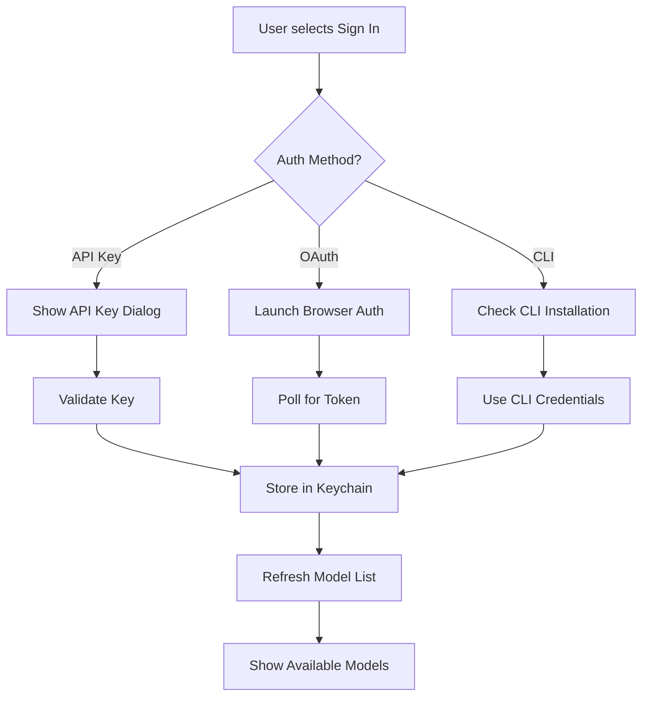
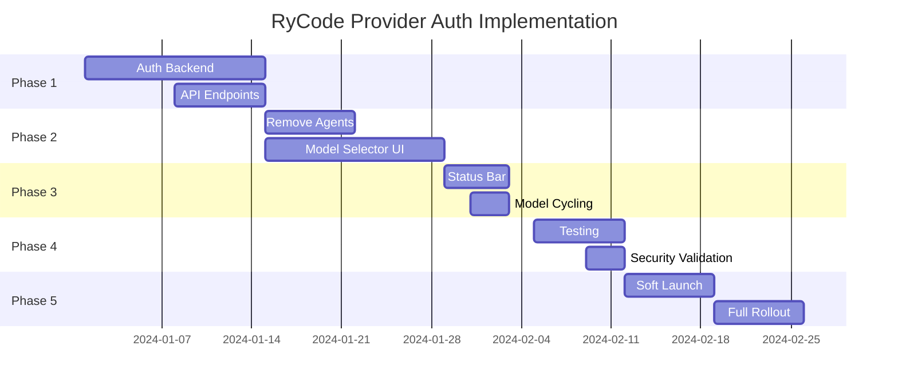

# RyCode Provider Authentication Implementation Plan

## Executive Summary

This plan outlines the transformation of RyCode from an agent-based system to a provider-centric model selection interface with integrated authentication. The implementation will be executed in 5 phases over 8 weeks with careful risk mitigation and rollback strategies.

---

## Phase 1: Foundation & Authentication Backend (Weeks 1-2)

### 1.1 Provider Authentication Manager

**Priority: Critical**
**Team: Backend (2 engineers)**

#### Tasks:
```typescript
// Week 1: Core Authentication Infrastructure
- [ ] Create ProviderAuthManager class
- [ ] Implement credential encryption/decryption
- [ ] Integrate OS keychain (Keytar for Node.js)
- [ ] Create auth status tracking system
- [ ] Build provider validation endpoints

// Week 2: Provider-Specific Implementations
- [ ] Anthropic API key validation
- [ ] Google OAuth 2.0 flow
- [ ] OpenAI key management
- [ ] Qwen/Alibaba Cloud authentication
- [ ] Grok (xAI) API key management
```

#### Code Structure:
```
packages/rycode/src/auth/
├── provider-auth.ts         # Main auth manager
├── providers/
│   ├── anthropic.ts         # Anthropic-specific auth
│   ├── google.ts            # Google OAuth implementation
│   ├── openai.ts            # OpenAI auth handling
│   ├── qwen.ts              # Qwen authentication
│   └── grok.ts              # Grok (xAI) authentication
├── storage/
│   ├── keychain.ts          # OS keychain integration
│   └── encrypted-store.ts   # Fallback encrypted storage
└── validators/
    └── credential-validator.ts
```

#### Technical Decisions:
- **Keychain Library**: Use `keytar` for cross-platform OS keychain
- **Encryption**: AES-256-GCM for fallback storage
- **Token Storage**: Separate refresh/access tokens
- **Session Management**: 30-day refresh cycle

#### Risk Mitigation:
- Implement fallback to encrypted file storage if keychain unavailable
- Add credential validation before storage
- Include rate limiting on auth attempts
- Log auth events for security audit

### 1.2 API Endpoints

**Priority: Critical**
**Team: Backend (1 engineer)**

#### New Endpoints:
```typescript
// Provider Authentication
POST   /api/providers/{provider}/auth
GET    /api/providers/{provider}/status
DELETE /api/providers/{provider}/auth
POST   /api/providers/{provider}/refresh

// Provider Models with Auth Status
GET    /api/providers/models?authenticated=true
GET    /api/providers/{provider}/models
```

#### Migration from Agent Endpoints:
```diff
- GET /api/agents
- GET /api/agents/{name}
- POST /api/agents/{name}/select
+ GET /api/models/current
+ POST /api/models/select
```

### 1.3 Security Infrastructure

**Priority: Critical**
**Team: Security (1 engineer)**

#### Security Measures:
```yaml
credential_security:
  storage:
    - OS keychain primary
    - Encrypted file fallback
    - Never in plain text

  transmission:
    - HTTPS only
    - Token in Authorization header
    - No credentials in URLs

  validation:
    - Validate on store
    - Re-validate on use
    - Expire after inactivity
```

#### Audit Logging:
```typescript
interface AuthAuditLog {
  timestamp: Date
  provider: string
  action: 'auth' | 'refresh' | 'revoke'
  success: boolean
  userId?: string
  ipAddress?: string
  errorReason?: string
}
```

---

## Phase 2: Model Selector UI Transformation (Weeks 3-4)

### 2.1 Remove Agent Components

**Priority: High**
**Team: Frontend (2 engineers)**

#### Week 3: Component Removal
```diff
packages/tui/internal/
- components/dialog/agents.go
+ components/dialog/provider-auth.go

- app/agent-state.go
+ app/model-state.go

status/status.go
- agentDisplay()
+ modelDisplay()
```

#### Deprecation Strategy:
1. Add deprecation warnings to agent configs
2. Map agent preferences to model preferences
3. Create agent-to-model migration utility
4. Log usage of deprecated features

### 2.2 New Model Selector Implementation

**Priority: Critical**
**Team: Frontend (2 engineers)**

#### UI Components:
```go
// packages/tui/internal/components/dialog/models-enhanced.go

type EnhancedModelDialog struct {
    providers       []ProviderSection
    searchDialog    *SearchDialog
    authDialog      AuthDialog        // New: inline auth
    currentProvider *Provider
}

type ProviderSection struct {
    Provider        ProviderInfo
    AuthStatus      AuthenticationStatus
    Models          []Model
    Actions         []ProviderAction
}

type AuthenticationStatus struct {
    IsAuthenticated bool
    Method          string      // "api-key", "oauth", etc.
    UserIdentifier  string      // email or key preview
    ExpiresAt       *time.Time
}
```

#### Visual Layout:
```
┌─────────────────────────────────────┐
│ Model Selector                  [×] │
├─────────────────────────────────────┤
│ 🔍 Search models...                 │
├─────────────────────────────────────┤
│ ⭐ Recent (last 7 days)             │
│  └─ Claude 3.5 Sonnet         2min │
├─────────────────────────────────────┤
│ ✓ Anthropic (sk-ant...7c9)         │
│  ├─ Claude 3.5 Sonnet [DEFAULT]    │
│  ├─ Claude 3.5 Haiku               │
│  └─ [Manage Key]                   │
├─────────────────────────────────────┤
│ 🔐 Google                           │
│  └─ [Sign in with Google]          │
└─────────────────────────────────────┘
```

### 2.3 Authentication Dialogs

**Priority: High**
**Team: Frontend (1 engineer)**

#### Dialog Types:
```go
// API Key Dialog
type APIKeyDialog struct {
    provider    string
    textInput   textinput.Model
    validation  ValidationStatus
    helpURL     string
}

// OAuth Dialog
type OAuthDialog struct {
    provider    string
    authURL     string
    state       string
    polling     bool
}

// CLI Integration Dialog
type CLIDialog struct {
    provider    string
    command     string
    detected    bool
}
```

#### Authentication Flow:


---

## Phase 3: Status Bar & Model Cycling (Week 5)

### 3.1 Status Bar Redesign

**Priority: High**
**Team: Frontend (1 engineer)**

#### Implementation:
```go
// packages/tui/internal/components/status/status.go

func (m *statusComponent) modelDisplay() string {
    if m.app.Model == nil {
        return m.renderNoModel()
    }

    // Provider-specific coloring
    providerColor := GetProviderColor(m.app.Provider.ID)

    // Smart truncation
    modelName := m.truncateModelName(m.app.Model.Name, m.availableWidth)

    // Keyboard hint
    hint := m.renderHint()

    return fmt.Sprintf("%s %s",
        providerColor.Bold().Render(modelName),
        m.theme.Muted().Render(hint))
}

func (m *statusComponent) renderHint() string {
    if !m.app.HasAuthenticatedProviders() {
        return "[/ to configure]"
    }
    if m.app.GetAuthenticatedModelCount() > 1 {
        return "[tab to switch]"
    }
    return ""
}
```

### 3.2 Tab Key Model Cycling

**Priority: High**
**Team: Frontend (1 engineer)**

#### Cycling Logic:
```go
func (a *App) CycleModel(forward bool) (*App, tea.Cmd) {
    models := a.getAuthenticatedModels()

    if len(models) == 0 {
        return a, toast.Error("No authenticated models available")
    }

    if len(models) == 1 {
        return a, toast.Info("Only one model available")
    }

    currentIdx := a.findCurrentModelIndex(models)
    nextIdx := a.calculateNextIndex(currentIdx, len(models), forward)

    return a.switchToModel(models[nextIdx])
}

// Smart model ordering
func (a *App) getAuthenticatedModels() []ModelWithProvider {
    models := a.collectAuthenticatedModels()

    // Sort by: 1) Recent usage 2) Provider preference 3) Cost
    sort.Slice(models, func(i, j int) bool {
        // Recent usage first
        if a.wasRecentlyUsed(models[i]) != a.wasRecentlyUsed(models[j]) {
            return a.wasRecentlyUsed(models[i])
        }

        // Provider preference
        iPref := a.getProviderPreference(models[i].Provider)
        jPref := a.getProviderPreference(models[j].Provider)
        if iPref != jPref {
            return iPref < jPref
        }

        // Cost (cheaper first for same provider)
        return models[i].Model.Cost < models[j].Model.Cost
    })

    return models
}
```

---

## Phase 4: Testing & Validation (Week 6)

### 4.1 Unit Testing

**Priority: Critical**
**Team: QA (2 engineers)**

#### Test Coverage Requirements:
```yaml
authentication:
  - Credential storage/retrieval
  - Encryption/decryption
  - Token refresh logic
  - Provider validation
  coverage_target: 90%

ui_components:
  - Model selector interactions
  - Authentication dialogs
  - Status bar updates
  - Keyboard shortcuts
  coverage_target: 85%

migration:
  - Agent to model mapping
  - Config migration
  - State preservation
  coverage_target: 95%
```

### 4.2 Integration Testing

#### Test Scenarios:
```typescript
describe('Provider Authentication Flow', () => {
  test('Anthropic API key authentication', async () => {
    // 1. Open model selector
    // 2. Click "Sign In" for Anthropic
    // 3. Enter API key
    // 4. Verify models appear
    // 5. Select a model
    // 6. Verify it's set as current
  })

  test('Google OAuth flow', async () => {
    // 1. Initiate OAuth
    // 2. Mock browser authentication
    // 3. Verify token storage
    // 4. Check model availability
  })

  test('Model cycling with Tab key', async () => {
    // 1. Authenticate multiple providers
    // 2. Press Tab
    // 3. Verify model changes
    // 4. Verify status bar updates
  })
})
```

### 4.3 Security Testing

#### Security Checklist:
- [ ] API keys never logged in plain text
- [ ] Credentials encrypted at rest
- [ ] Token refresh works correctly
- [ ] Rate limiting on auth attempts
- [ ] Audit logs capture all auth events
- [ ] XSS protection in auth dialogs
- [ ] CSRF tokens for web auth flows

---

## Phase 5: Rollout & Migration (Weeks 7-8)

### 5.1 Feature Flag Implementation

**Priority: High**
**Team: DevOps (1 engineer)**

#### Feature Flags:
```typescript
const FEATURE_FLAGS = {
  PROVIDER_AUTH: {
    enabled: process.env.ENABLE_PROVIDER_AUTH === 'true',
    percentage: parseInt(process.env.PROVIDER_AUTH_ROLLOUT) || 0,
    allowlist: process.env.PROVIDER_AUTH_USERS?.split(',') || [],
  },
  LEGACY_AGENTS: {
    enabled: process.env.ENABLE_LEGACY_AGENTS !== 'false',
    deprecationWarning: true,
  },
}
```

### 5.2 Migration Strategy

#### Week 7: Soft Launch
```yaml
rollout_plan:
  day_1-2:
    percentage: 5%
    monitoring: enhanced
    rollback_threshold: 5% error rate

  day_3-4:
    percentage: 25%
    monitoring: normal
    rollback_threshold: 10% error rate

  day_5-7:
    percentage: 50%
    monitoring: normal
    rollback_threshold: 15% error rate
```

#### Week 8: Full Rollout
```yaml
final_rollout:
  day_1:
    percentage: 100%
    legacy_agents: deprecated
    monitoring: enhanced

  day_3:
    legacy_agents: removed
    cleanup: true
```

### 5.3 User Migration

#### Migration Utilities:
```typescript
class AgentToModelMigrator {
  async migrate(config: LegacyConfig): Promise<NewConfig> {
    const newConfig: NewConfig = {
      providers: {},
      default_model: null,
    }

    // Map agent preferences to models
    if (config.agent?.build?.model) {
      const [provider, model] = config.agent.build.model.split('/')
      newConfig.providers[provider] = {
        default_model: model,
        authenticated: false, // Require re-auth
      }
    }

    return newConfig
  }

  async backupLegacyConfig(): Promise<void> {
    // Create backup before migration
    await fs.copy('.rycode/config.yml', '.rycode/config.backup.yml')
  }
}
```

---

## Risk Assessment & Mitigation

### High-Risk Areas

#### 1. Credential Security
**Risk**: API keys exposed or stolen
**Mitigation**:
- Use OS keychain as primary storage
- Implement encryption for fallback storage
- Add rate limiting on auth attempts
- Audit all credential access

#### 2. Breaking Changes
**Risk**: Existing workflows disrupted
**Mitigation**:
- Dual-mode operation during transition
- Comprehensive migration utilities
- Clear documentation and warnings
- Rollback capability

#### 3. Provider API Changes
**Risk**: Provider APIs change or break
**Mitigation**:
- Version lock provider SDKs
- Implement retry logic
- Graceful degradation
- Provider-specific error handling

### Rollback Strategy

#### Instant Rollback Triggers:
- Error rate > 15%
- Authentication failures > 10%
- Crash rate > 5%
- User complaints > threshold

#### Rollback Procedure:
```bash
# 1. Disable feature flag
export ENABLE_PROVIDER_AUTH=false

# 2. Restore agent system
export ENABLE_LEGACY_AGENTS=true

# 3. Notify users
rycode notify "Reverting to previous version"

# 4. Restore configs
rycode restore-config --from-backup
```

---

## Success Metrics

### Technical Metrics
- **Authentication Success Rate**: > 95%
- **Model Switch Latency**: < 100ms
- **Credential Storage Success**: > 99%
- **Migration Success Rate**: > 98%

### User Metrics
- **Time to First Model**: < 2 minutes
- **Daily Active Users**: No decrease
- **Support Tickets**: < 5% increase
- **User Satisfaction**: > 4.0/5.0

### Performance Metrics
- **Memory Usage**: < 10% increase
- **Startup Time**: < 5% increase
- **API Response Time**: < 200ms p95

---

## Team Organization

### Team Structure
```
Project Lead (1)
├── Backend Team (3)
│   ├── Auth Implementation (2)
│   └── API Development (1)
├── Frontend Team (3)
│   ├── TUI Components (2)
│   └── Status Bar (1)
├── QA Team (2)
│   ├── Testing (1)
│   └── Security Validation (1)
└── DevOps (1)
    └── Rollout Management
```

### Communication Plan
- Daily standups during implementation
- Weekly stakeholder updates
- Immediate escalation for blockers
- Slack channel: #provider-auth-migration

---

## Timeline Summary



---

## Conclusion

This implementation plan provides a structured approach to transforming RyCode from an agent-based system to a provider-centric model selection interface. The phased approach minimizes risk while ensuring thorough testing and validation at each stage. With proper execution, users will have a more transparent and flexible tool for AI model selection within 8 weeks.

**Key Success Factors:**
1. Secure credential management
2. Seamless migration experience
3. Intuitive authentication flow
4. Reliable model switching
5. Comprehensive testing

The plan includes sufficient rollback strategies and risk mitigation to ensure a smooth transition for all users.