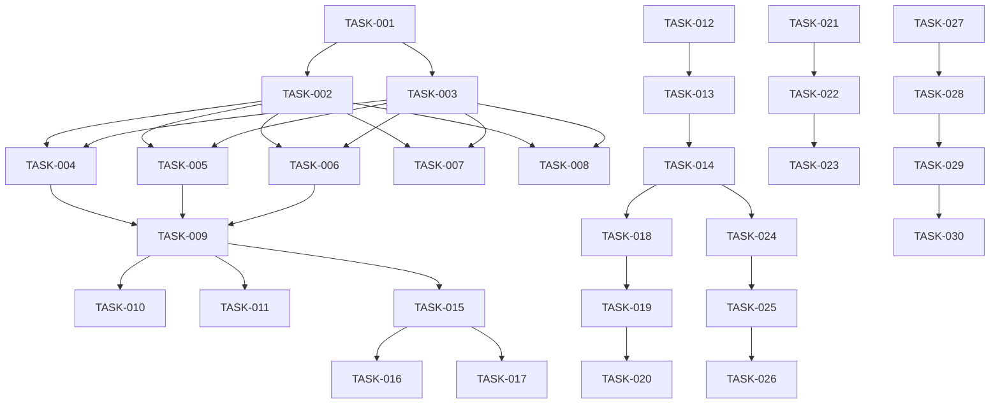

# RyCode Provider Authentication - Implementation Tasks

## Task Tracking System

**Priority Levels:**
- 🔴 P0: Critical blocker
- 🟠 P1: High priority
- 🟡 P2: Medium priority
- 🟢 P3: Low priority

**Status Indicators:**
- ⬜ Not started
- 🟦 In progress
- ✅ Complete
- ❌ Blocked

---

## Week 1: Authentication Infrastructure

### TASK-001: Setup Provider Auth Package Structure
**Priority:** 🔴 P0
**Status:** ⬜ Not started
**Assignee:** Backend Lead
**Dependencies:** None
**Estimate:** 4 hours

```bash
mkdir -p packages/rycode/src/auth/{providers,storage,validators}
touch packages/rycode/src/auth/provider-auth.ts
touch packages/rycode/src/auth/providers/{anthropic,google,openai,qwen,grok}.ts
```

**Acceptance Criteria:**
- [ ] Package structure created
- [ ] Base interfaces defined
- [ ] TypeScript configs updated
- [ ] Import paths configured

---

### TASK-002: Implement OS Keychain Integration
**Priority:** 🔴 P0
**Status:** ⬜ Not started
**Assignee:** Backend Engineer 1
**Dependencies:** TASK-001
**Estimate:** 8 hours

```typescript
// packages/rycode/src/auth/storage/keychain.ts
class KeychainManager {
  async store(service: string, account: string, password: string): Promise<void>
  async retrieve(service: string, account: string): Promise<string | null>
  async delete(service: string, account: string): Promise<void>
  async isAvailable(): Promise<boolean>
}
```

**Acceptance Criteria:**
- [ ] Install `keytar` package
- [ ] Implement cross-platform keychain access
- [ ] Add fallback detection
- [ ] Unit tests passing
- [ ] Error handling for keychain unavailable

---

### TASK-003: Create Encrypted Storage Fallback
**Priority:** 🔴 P0
**Status:** ⬜ Not started
**Assignee:** Backend Engineer 1
**Dependencies:** TASK-001
**Estimate:** 6 hours

```typescript
// packages/rycode/src/auth/storage/encrypted-store.ts
class EncryptedStore {
  private encryptionKey: Buffer
  async encrypt(data: string): Promise<string>
  async decrypt(data: string): Promise<string>
  async store(key: string, value: string): Promise<void>
  async retrieve(key: string): Promise<string | null>
}
```

**Acceptance Criteria:**
- [ ] AES-256-GCM encryption implemented
- [ ] Key derivation from machine ID
- [ ] File-based storage in user config dir
- [ ] Migration from plain text configs
- [ ] Security audit passed

---

### TASK-004: Implement Anthropic Authentication
**Priority:** 🟠 P1
**Status:** ⬜ Not started
**Assignee:** Backend Engineer 2
**Dependencies:** TASK-002, TASK-003
**Estimate:** 6 hours

**Code Implementation:**
```typescript
// packages/rycode/src/auth/providers/anthropic.ts
export class AnthropicAuth {
  async authenticate(apiKey: string): Promise<AuthResult>
  async validate(apiKey: string): Promise<boolean>
  async getModels(apiKey: string): Promise<Model[]>
  async refreshCredentials(): Promise<void>
}
```

**Acceptance Criteria:**
- [ ] API key validation endpoint working
- [ ] Model list retrieval implemented
- [ ] Error messages user-friendly
- [ ] Rate limiting handled
- [ ] Integration test passing

---

### TASK-005: Implement Google OAuth Flow
**Priority:** 🟠 P1
**Status:** ⬜ Not started
**Assignee:** Backend Engineer 2
**Dependencies:** TASK-002, TASK-003
**Estimate:** 12 hours

**OAuth Configuration:**
```typescript
// packages/rycode/src/auth/providers/google.ts
const GOOGLE_OAUTH = {
  clientId: process.env.GOOGLE_CLIENT_ID,
  clientSecret: process.env.GOOGLE_CLIENT_SECRET,
  redirectUri: 'http://localhost:4096/auth/google/callback',
  scope: 'https://www.googleapis.com/auth/cloud-platform'
}
```

**Acceptance Criteria:**
- [ ] OAuth 2.0 flow implemented
- [ ] Token refresh logic working
- [ ] Browser launch handled
- [ ] Callback server implemented
- [ ] Token storage secure
- [ ] Refresh token managed

---

### TASK-006: Implement OpenAI Authentication
**Priority:** 🟠 P1
**Status:** ⬜ Not started
**Assignee:** Backend Engineer 3
**Dependencies:** TASK-002, TASK-003
**Estimate:** 4 hours

**Acceptance Criteria:**
- [ ] API key validation
- [ ] Organization ID support
- [ ] Model permissions checked
- [ ] Azure OpenAI support
- [ ] Usage tracking enabled

---

### TASK-007: Implement Qwen Authentication
**Priority:** 🟡 P2
**Status:** ⬜ Not started
**Assignee:** Backend Engineer 3
**Dependencies:** TASK-002, TASK-003
**Estimate:** 6 hours

**Acceptance Criteria:**
- [ ] Access key validation
- [ ] Region configuration
- [ ] RAM role support
- [ ] Chinese documentation
- [ ] Alibaba Cloud SDK integrated

---

### TASK-008: Implement Grok (xAI) Authentication
**Priority:** 🟡 P2
**Status:** ⬜ Not started
**Assignee:** Backend Engineer 3
**Dependencies:** TASK-002, TASK-003
**Estimate:** 4 hours

**Acceptance Criteria:**
- [ ] API key validation
- [ ] Model list retrieval
- [ ] Rate limit handling (60/min)
- [ ] Real-time features flag
- [ ] Cost tier detection

---

## Week 2: API Endpoints & Validation

### TASK-009: Create Provider Status Endpoints
**Priority:** 🔴 P0
**Status:** ⬜ Not started
**Assignee:** Backend Lead
**Dependencies:** TASK-004, TASK-005, TASK-006
**Estimate:** 6 hours

**Endpoints to Create:**
```typescript
GET  /api/providers              // List all providers with auth status
GET  /api/providers/:id/status   // Check specific provider auth
POST /api/providers/:id/auth     // Authenticate with provider
DELETE /api/providers/:id/auth   // Revoke authentication
POST /api/providers/:id/refresh  // Refresh tokens
```

**Acceptance Criteria:**
- [ ] All endpoints functional
- [ ] OpenAPI spec updated
- [ ] Rate limiting applied
- [ ] Error responses consistent
- [ ] Audit logging enabled

---

### TASK-010: Implement Credential Validation System
**Priority:** 🔴 P0
**Status:** ⬜ Not started
**Assignee:** Backend Engineer 1
**Dependencies:** TASK-009
**Estimate:** 8 hours

**Validation Pipeline:**
```typescript
interface CredentialValidator {
  validateOnStore(credential: Credential): Promise<boolean>
  validateOnUse(credential: Credential): Promise<boolean>
  checkExpiration(credential: Credential): boolean
  sanitizeForLogging(credential: Credential): string
}
```

**Acceptance Criteria:**
- [ ] Validation on every store
- [ ] Re-validation before use
- [ ] Expiration checking
- [ ] Credential rotation support
- [ ] Security audit passed

---

### TASK-011: Add Authentication Audit Logging
**Priority:** 🟠 P1
**Status:** ⬜ Not started
**Assignee:** Security Engineer
**Dependencies:** TASK-009
**Estimate:** 6 hours

**Audit Log Schema:**
```typescript
interface AuthAuditLog {
  id: string
  timestamp: Date
  provider: string
  action: 'auth' | 'refresh' | 'revoke' | 'validate'
  success: boolean
  userId?: string
  ipAddress?: string
  userAgent?: string
  errorReason?: string
  metadata?: Record<string, any>
}
```

**Acceptance Criteria:**
- [ ] All auth events logged
- [ ] PII properly redacted
- [ ] Log rotation configured
- [ ] Query interface available
- [ ] Compliance requirements met

---

## Week 3: Remove Agent System

### TASK-012: Deprecate Agent Commands
**Priority:** 🔴 P0
**Status:** ⬜ Not started
**Assignee:** Frontend Lead
**Dependencies:** None
**Estimate:** 4 hours

**Files to Modify:**
```diff
packages/tui/internal/commands/command.go
- AgentCycleCommand
- AgentCycleReverseCommand
- SwitchAgentCommand
+ ModelCycleCommand
+ ModelSelectorCommand
+ ProviderAuthCommand
```

**Acceptance Criteria:**
- [ ] Agent commands removed
- [ ] Model commands added
- [ ] Keybindings updated
- [ ] Help text updated
- [ ] No compilation errors

---

### TASK-013: Remove Agent Dialog Component
**Priority:** 🔴 P0
**Status:** ⬜ Not started
**Assignee:** Frontend Engineer 1
**Dependencies:** TASK-012
**Estimate:** 6 hours

**Files to Delete:**
```bash
rm packages/tui/internal/components/dialog/agents.go
rm packages/rycode/src/agent/
rm packages/rycode/src/cli/cmd/agent.ts
```

**Acceptance Criteria:**
- [ ] Agent files removed
- [ ] References cleaned up
- [ ] No broken imports
- [ ] Tests updated
- [ ] Documentation updated

---

### TASK-014: Migrate Agent State to Model State
**Priority:** 🔴 P0
**Status:** ⬜ Not started
**Assignee:** Frontend Engineer 1
**Dependencies:** TASK-013
**Estimate:** 8 hours

**Migration Mapping:**
```go
// packages/tui/internal/app/migration.go
func MigrateAgentState(old AgentState) ModelState {
  return ModelState{
    Provider: mapAgentToProvider(old.Agent),
    Model: mapAgentToModel(old.Agent),
    RecentModels: extractRecentModels(old.History),
  }
}
```

**Acceptance Criteria:**
- [ ] State migration function works
- [ ] Existing preferences preserved
- [ ] Backup created before migration
- [ ] Rollback possible
- [ ] User notified of changes

---

## Week 4: Model Selector Enhancement

### TASK-015: Create Enhanced Model Dialog
**Priority:** 🔴 P0
**Status:** ⬜ Not started
**Assignee:** Frontend Lead
**Dependencies:** TASK-009
**Estimate:** 12 hours

**Component Structure:**
```go
type EnhancedModelDialog struct {
  providers     []ProviderSection
  authDialog    AuthDialog
  searchDialog  *SearchDialog
}

type ProviderSection struct {
  Provider      ProviderInfo
  AuthStatus    AuthStatus
  Models        []Model
  Actions       []Action
}
```

**Acceptance Criteria:**
- [ ] Provider sections display correctly
- [ ] Auth status visible
- [ ] Search functionality works
- [ ] Keyboard navigation smooth
- [ ] Visual hierarchy clear

---

### TASK-016: Implement Inline Auth Dialogs
**Priority:** 🔴 P0
**Status:** ⬜ Not started
**Assignee:** Frontend Engineer 2
**Dependencies:** TASK-015
**Estimate:** 10 hours

**Dialog Types:**
```go
type APIKeyDialog struct {
  provider  string
  textInput textinput.Model
  helpURL   string
}

type OAuthDialog struct {
  provider  string
  authURL   string
  polling   bool
}
```

**Acceptance Criteria:**
- [ ] API key input works
- [ ] OAuth flow launches browser
- [ ] Help URLs displayed
- [ ] Validation feedback immediate
- [ ] Error messages helpful

---

### TASK-017: Add Provider Visual Indicators
**Priority:** 🟡 P2
**Status:** ⬜ Not started
**Assignee:** Frontend Engineer 2
**Dependencies:** TASK-015
**Estimate:** 4 hours

**Visual Elements:**
```
✓ Authenticated
🔐 Not authenticated
⏳ Authenticating
⚠️ Auth expired
💰 Cost tier indicator
🧠 Reasoning capability
👁️ Vision capability
```

**Acceptance Criteria:**
- [ ] Icons display correctly
- [ ] Colors consistent
- [ ] Tooltips implemented
- [ ] Accessibility labels added
- [ ] Dark/light theme support

---

## Week 5: Status Bar & Model Cycling

### TASK-018: Replace Agent Display with Model Display
**Priority:** 🔴 P0
**Status:** ⬜ Not started
**Assignee:** Frontend Engineer 3
**Dependencies:** TASK-014
**Estimate:** 6 hours

**Status Bar Format:**
```go
func (m *statusComponent) modelDisplay() string {
  // Before: [tab] BUILD AGENT
  // After:  Claude 3.5 Sonnet [tab]
  return fmt.Sprintf("%s %s",
    providerColor.Render(modelName),
    hint.Render("[tab]"))
}
```

**Acceptance Criteria:**
- [ ] Model name displays
- [ ] Provider color applied
- [ ] Truncation works
- [ ] Hint shows correctly
- [ ] Updates on model change

---

### TASK-019: Implement Tab Key Model Cycling
**Priority:** 🔴 P0
**Status:** ⬜ Not started
**Assignee:** Frontend Engineer 3
**Dependencies:** TASK-018
**Estimate:** 8 hours

**Cycling Logic:**
```go
func (a *App) CycleModel(forward bool) (*App, tea.Cmd) {
  models := a.getAuthenticatedModels()
  nextIdx := calculateNext(currentIdx, forward)
  a.setCurrentModel(models[nextIdx])
  return a, toast.Success("Switched to " + models[nextIdx].Name)
}
```

**Acceptance Criteria:**
- [ ] Tab cycles forward
- [ ] Shift+Tab cycles backward
- [ ] Only authenticated models included
- [ ] Toast notification shows
- [ ] State persisted

---

### TASK-020: Add Quick Model Switch (1-9 keys)
**Priority:** 🟢 P3
**Status:** ⬜ Not started
**Assignee:** Frontend Engineer 3
**Dependencies:** TASK-019
**Estimate:** 4 hours

**Acceptance Criteria:**
- [ ] Keys 1-9 switch to model
- [ ] Only in model selector
- [ ] Visual indicators for shortcuts
- [ ] Configurable in settings
- [ ] Help text updated

---

## Week 6: Testing & Validation

### TASK-021: Create Auth Integration Tests
**Priority:** 🔴 P0
**Status:** ⬜ Not started
**Assignee:** QA Engineer 1
**Dependencies:** TASK-004 through TASK-008
**Estimate:** 12 hours

**Test Coverage:**
```typescript
describe('Provider Authentication', () => {
  test('Anthropic API key flow')
  test('Google OAuth flow')
  test('OpenAI key validation')
  test('Qwen access key flow')
  test('Grok authentication')
  test('Invalid credentials handling')
  test('Token refresh mechanism')
})
```

**Acceptance Criteria:**
- [ ] All providers tested
- [ ] Happy path covered
- [ ] Error cases covered
- [ ] Mock servers configured
- [ ] CI/CD integrated

---

### TASK-022: Security Audit Testing
**Priority:** 🔴 P0
**Status:** ⬜ Not started
**Assignee:** Security Engineer
**Dependencies:** TASK-021
**Estimate:** 8 hours

**Security Checklist:**
```yaml
credential_security:
  - [ ] No plain text storage
  - [ ] No credentials in logs
  - [ ] Encryption at rest
  - [ ] Secure transmission

authentication:
  - [ ] Rate limiting works
  - [ ] Token expiration handled
  - [ ] CSRF protection
  - [ ] XSS prevention
```

**Acceptance Criteria:**
- [ ] All security tests pass
- [ ] Penetration test complete
- [ ] Audit logs reviewed
- [ ] Compliance verified
- [ ] Documentation updated

---

### TASK-023: Load Testing Model Switching
**Priority:** 🟡 P2
**Status:** ⬜ Not started
**Assignee:** QA Engineer 2
**Dependencies:** TASK-019
**Estimate:** 6 hours

**Performance Targets:**
```yaml
model_switching:
  latency_p50: < 50ms
  latency_p95: < 100ms
  latency_p99: < 200ms

memory_usage:
  increase: < 10%

cpu_usage:
  spike: < 20%
```

**Acceptance Criteria:**
- [ ] Performance targets met
- [ ] No memory leaks
- [ ] Stress test passed
- [ ] Profiling complete
- [ ] Optimization applied

---

## Week 7: Migration & Documentation

### TASK-024: Create Migration Utility
**Priority:** 🔴 P0
**Status:** ⬜ Not started
**Assignee:** Backend Lead
**Dependencies:** TASK-014
**Estimate:** 8 hours

**Migration Script:**
```bash
#!/bin/bash
# migrate-to-provider-auth.sh

backup_config() {
  cp ~/.rycode/config.yml ~/.rycode/config.backup.yml
}

migrate_agents() {
  rycode migrate agents-to-models
}

notify_user() {
  echo "Migration complete. Please re-authenticate with providers."
}
```

**Acceptance Criteria:**
- [ ] Backup created
- [ ] Agent configs migrated
- [ ] User preferences preserved
- [ ] Rollback possible
- [ ] Documentation provided

---

### TASK-025: Update User Documentation
**Priority:** 🟠 P1
**Status:** ⬜ Not started
**Assignee:** Technical Writer
**Dependencies:** All UI tasks
**Estimate:** 12 hours

**Documentation Updates:**
```markdown
- Getting Started guide
- Provider authentication guide
- Model selection guide
- Keyboard shortcuts reference
- Migration guide from agents
- Troubleshooting guide
- API documentation
```

**Acceptance Criteria:**
- [ ] All guides updated
- [ ] Screenshots current
- [ ] Videos recorded
- [ ] FAQ updated
- [ ] Reviewed by team

---

### TASK-026: Create Provider Setup Guides
**Priority:** 🟠 P1
**Status:** ⬜ Not started
**Assignee:** Technical Writer
**Dependencies:** TASK-025
**Estimate:** 8 hours

**Provider Guides:**
```markdown
1. Anthropic Setup
   - Getting API key
   - Cost management
   - Model selection

2. Google Setup
   - OAuth configuration
   - Project setup
   - Billing alerts

3. OpenAI Setup
   - API key creation
   - Organization setup
   - Usage monitoring

4. Qwen Setup
   - Alibaba Cloud account
   - Access key creation
   - Region selection

5. Grok Setup
   - xAI console access
   - API key generation
   - Feature configuration
```

**Acceptance Criteria:**
- [ ] All providers documented
- [ ] Step-by-step instructions
- [ ] Common issues covered
- [ ] Links to provider docs
- [ ] Reviewed by providers

---

## Week 8: Rollout & Monitoring

### TASK-027: Implement Feature Flags
**Priority:** 🔴 P0
**Status:** ⬜ Not started
**Assignee:** DevOps Engineer
**Dependencies:** All previous tasks
**Estimate:** 6 hours

**Feature Flag Configuration:**
```typescript
const FEATURE_FLAGS = {
  PROVIDER_AUTH_ENABLED: false,
  PROVIDER_AUTH_PERCENTAGE: 0,
  PROVIDER_AUTH_USERS: [],
  LEGACY_AGENTS_ENABLED: true,
  SHOW_MIGRATION_BANNER: true
}
```

**Acceptance Criteria:**
- [ ] Feature flags working
- [ ] Gradual rollout possible
- [ ] User targeting works
- [ ] Quick rollback available
- [ ] Monitoring integrated

---

### TASK-028: Setup Monitoring Dashboard
**Priority:** 🔴 P0
**Status:** ⬜ Not started
**Assignee:** DevOps Engineer
**Dependencies:** TASK-027
**Estimate:** 8 hours

**Metrics to Track:**
```yaml
authentication:
  success_rate: track per provider
  failure_reasons: categorize
  time_to_auth: measure latency

usage:
  model_switches: count per session
  provider_distribution: percentage
  feature_adoption: track uptake

performance:
  api_latency: p50, p95, p99
  memory_usage: track increase
  error_rate: monitor spikes
```

**Acceptance Criteria:**
- [ ] Dashboard created
- [ ] Alerts configured
- [ ] Metrics flowing
- [ ] Reports automated
- [ ] Team trained

---

### TASK-029: Gradual Rollout Execution
**Priority:** 🔴 P0
**Status:** ⬜ Not started
**Assignee:** Release Manager
**Dependencies:** TASK-027, TASK-028
**Estimate:** 40 hours (1 week)

**Rollout Schedule:**
```
Day 1-2: 5% of users
Day 3-4: 25% of users
Day 5-6: 50% of users
Day 7: 100% of users
```

**Acceptance Criteria:**
- [ ] Each phase successful
- [ ] Metrics within targets
- [ ] User feedback positive
- [ ] No critical issues
- [ ] Rollback not needed

---

### TASK-030: Post-Launch Support
**Priority:** 🟠 P1
**Status:** ⬜ Not started
**Assignee:** Support Team
**Dependencies:** TASK-029
**Estimate:** Ongoing

**Support Preparation:**
```yaml
training:
  - Support team trained
  - FAQ prepared
  - Escalation paths defined

resources:
  - Help articles written
  - Video tutorials created
  - Community forum ready

monitoring:
  - Support ticket tracking
  - User sentiment analysis
  - Issue categorization
```

**Acceptance Criteria:**
- [ ] Support team ready
- [ ] Resources available
- [ ] Response times met
- [ ] User satisfaction high
- [ ] Issues resolved quickly

---

## Task Dependencies Graph



---

## Critical Path

The following tasks are on the critical path and any delay will impact the overall timeline:

1. **TASK-001**: Setup Provider Auth Package Structure
2. **TASK-002**: Implement OS Keychain Integration
3. **TASK-004**: Implement Anthropic Authentication
4. **TASK-009**: Create Provider Status Endpoints
5. **TASK-012**: Deprecate Agent Commands
6. **TASK-014**: Migrate Agent State to Model State
7. **TASK-015**: Create Enhanced Model Dialog
8. **TASK-018**: Replace Agent Display with Model Display
9. **TASK-019**: Implement Tab Key Model Cycling
10. **TASK-027**: Implement Feature Flags
11. **TASK-029**: Gradual Rollout Execution

---

## Resource Allocation

### Team Assignment Summary

**Backend Team (3 engineers)**
- Backend Lead: TASK-001, TASK-009, TASK-024
- Backend Engineer 1: TASK-002, TASK-003, TASK-010
- Backend Engineer 2: TASK-004, TASK-005
- Backend Engineer 3: TASK-006, TASK-007, TASK-008

**Frontend Team (3 engineers)**
- Frontend Lead: TASK-012, TASK-015
- Frontend Engineer 1: TASK-013, TASK-014
- Frontend Engineer 2: TASK-016, TASK-017
- Frontend Engineer 3: TASK-018, TASK-019, TASK-020

**QA Team (2 engineers)**
- QA Engineer 1: TASK-021
- QA Engineer 2: TASK-023

**Other Roles**
- Security Engineer: TASK-011, TASK-022
- Technical Writer: TASK-025, TASK-026
- DevOps Engineer: TASK-027, TASK-028
- Release Manager: TASK-029
- Support Team: TASK-030

---

## Risk Mitigation Tasks

### High-Risk Areas Requiring Extra Attention

1. **Credential Security (TASK-002, TASK-003)**
   - Add security review checkpoint
   - Implement penetration testing
   - Create security runbook

2. **OAuth Implementation (TASK-005)**
   - Add timeout handling
   - Implement retry logic
   - Create fallback to API key

3. **Migration (TASK-014, TASK-024)**
   - Create rollback procedure
   - Test with production data copy
   - Add progress indicators

4. **Feature Rollout (TASK-029)**
   - Define rollback triggers
   - Create incident response plan
   - Setup war room procedures

---

## Success Metrics per Task

Each task should meet these success criteria:

- **Code Quality:** 90% test coverage
- **Performance:** No regression > 5%
- **Security:** Pass security scan
- **Documentation:** Updated inline and external
- **User Experience:** No increase in support tickets

---

This comprehensive task list provides 30 actionable items with clear dependencies, priorities, and acceptance criteria for implementing the provider authentication system in RyCode.