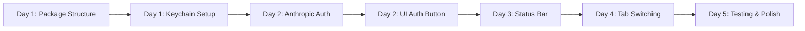

# RyCode Provider Auth - Quick Start Tasks

## Day 1: Essential Setup Tasks (8 hours)

### Morning (4 hours)
```bash
# TASK-001: Create package structure
mkdir -p packages/rycode/src/auth/{providers,storage,validators}
touch packages/rycode/src/auth/provider-auth.ts

# Install dependencies
bun add keytar
bun add @types/keytar --dev

# Create base interfaces
cat > packages/rycode/src/auth/types.ts << 'EOF'
export interface ProviderAuth {
  provider: string
  method: 'api-key' | 'oauth' | 'cli'
  credentials: any
  expiresAt?: Date
}

export interface AuthResult {
  success: boolean
  method: string
  expiresAt?: Date
  error?: string
}
EOF
```

### Afternoon (4 hours)
```bash
# TASK-002: Quick keychain implementation
cat > packages/rycode/src/auth/storage/keychain.ts << 'EOF'
import * as keytar from 'keytar'

const SERVICE = 'rycode'

export async function storeCredential(provider: string, credential: string) {
  try {
    await keytar.setPassword(SERVICE, provider, credential)
    return true
  } catch {
    // Fallback to encrypted file
    return storeEncrypted(provider, credential)
  }
}

export async function getCredential(provider: string) {
  try {
    return await keytar.getPassword(SERVICE, provider)
  } catch {
    return getEncrypted(provider)
  }
}
EOF
```

---

## Day 2: First Provider Implementation (8 hours)

### Morning: Anthropic Quick Win (4 hours)
```typescript
// TASK-004-QUICK: Minimal Anthropic auth
// packages/rycode/src/auth/providers/anthropic.ts

export async function authenticateAnthropic(apiKey: string) {
  // Quick validation
  const response = await fetch('https://api.anthropic.com/v1/models', {
    headers: { 'x-api-key': apiKey }
  })

  if (!response.ok) {
    throw new Error('Invalid API key')
  }

  // Store immediately
  await storeCredential('anthropic', apiKey)

  return {
    success: true,
    method: 'api-key' as const,
    models: await response.json()
  }
}
```

### Afternoon: Quick UI Update (4 hours)
```go
// TASK-015-QUICK: Add auth button to model selector
// packages/tui/internal/components/dialog/models.go

// Add to existing model dialog
if !provider.IsAuthenticated {
    items = append(items, actionItem{
        label: "[Sign In]",
        action: func() tea.Cmd {
            return showAPIKeyPrompt(provider.ID)
        },
    })
} else {
    // Show models as normal
    for _, model := range provider.Models {
        items = append(items, modelItem{model: model})
    }
}
```

---

## Day 3: Status Bar Quick Fix (4 hours)

### Morning Only
```go
// TASK-018-QUICK: Replace agent with model in status bar
// packages/tui/internal/components/status/status.go

func (m *statusComponent) View() string {
    // OLD: agentDisplay := "BUILD AGENT"
    // NEW:
    modelDisplay := "No model"
    if m.app.Model != nil {
        modelDisplay = m.app.Model.Name
    }

    return fmt.Sprintf("%s %s [tab]",
        m.logo(),
        modelDisplay)
}
```

---

## Day 4: Tab Key Model Switching (4 hours)

### Morning Only
```go
// TASK-019-QUICK: Basic tab cycling
// packages/tui/internal/app/app.go

func (a *App) HandleTab() tea.Cmd {
    models := a.getAuthenticatedModels()
    if len(models) < 2 {
        return nil
    }

    currentIdx := a.currentModelIndex()
    nextIdx := (currentIdx + 1) % len(models)

    a.Provider = models[nextIdx].Provider
    a.Model = models[nextIdx].Model

    return toast.New(fmt.Sprintf("Switched to %s", a.Model.Name))
}
```

---

## Week 1 Deliverables Checklist

### Must Have (P0)
- [ ] **Basic auth storage working** (keychain or encrypted file)
- [ ] **One provider authenticating** (Anthropic recommended)
- [ ] **Models showing in selector** for authenticated provider
- [ ] **Status bar shows current model** not agent
- [ ] **Tab key switches models** (basic functionality)

### Nice to Have (P1)
- [ ] Google OAuth started
- [ ] OpenAI auth working
- [ ] Visual auth indicators
- [ ] Migration script drafted

### Can Wait (P2)
- [ ] Qwen authentication
- [ ] Grok authentication
- [ ] Advanced UI polish
- [ ] Full test coverage

---

## Critical Path - First Week



---

## Quick Command Reference

### Start Development
```bash
# Setup
cd packages/rycode
bun install

# Run with provider auth enabled
ENABLE_PROVIDER_AUTH=true bun dev

# Test auth flow
curl -X POST localhost:4096/api/providers/anthropic/auth \
  -H "Content-Type: application/json" \
  -d '{"apiKey": "sk-ant-..."}'
```

### Quick Testing
```bash
# Test keychain
bun test src/auth/storage/keychain.test.ts

# Test provider auth
bun test src/auth/providers/anthropic.test.ts

# Manual UI test
cd packages/tui
go run cmd/rycode/main.go
```

---

## Blockers to Watch

1. **Keychain permissions** - May need user approval on macOS
2. **OAuth setup** - Need to register app with Google
3. **Rate limiting** - Implement early to avoid provider blocks
4. **Migration** - Don't break existing users

---

## Success Criteria - Week 1

✅ **Minimum Viable Provider Auth:**
- Users can enter an API key
- Models from that provider appear
- Can switch between models with Tab
- No more agent display

❌ **Not Required Yet:**
- All 5 providers working
- Perfect UI
- Complete test coverage
- Documentation

---

## Emergency Rollback

If things go wrong:

```bash
# Disable feature flag immediately
export ENABLE_PROVIDER_AUTH=false
export ENABLE_LEGACY_AGENTS=true

# Restore config
cp ~/.rycode/config.backup.yml ~/.rycode/config.yml

# Restart
rycode restart
```

---

This quick-start guide focuses on getting a working provider auth system in the first week, with just the essential tasks needed to demonstrate the concept and get user feedback early.